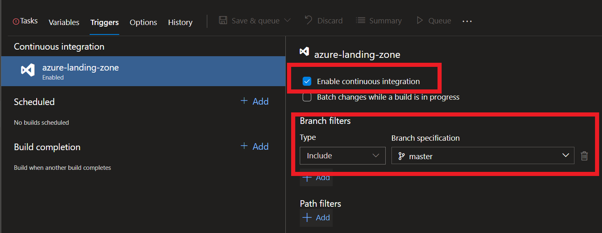
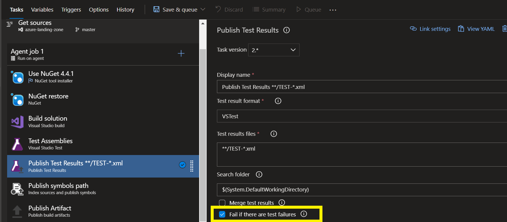
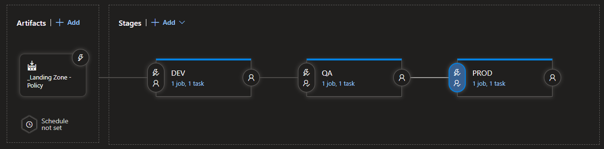
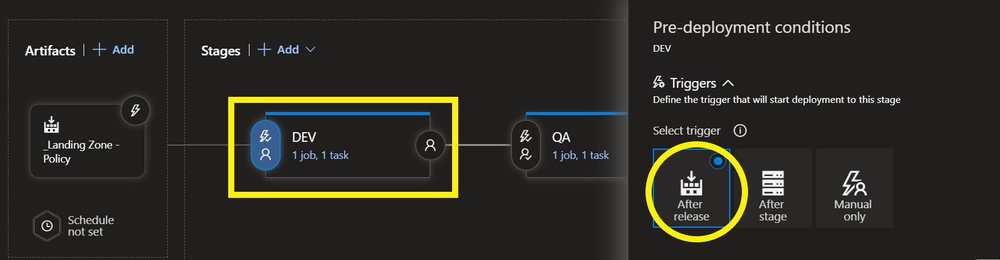
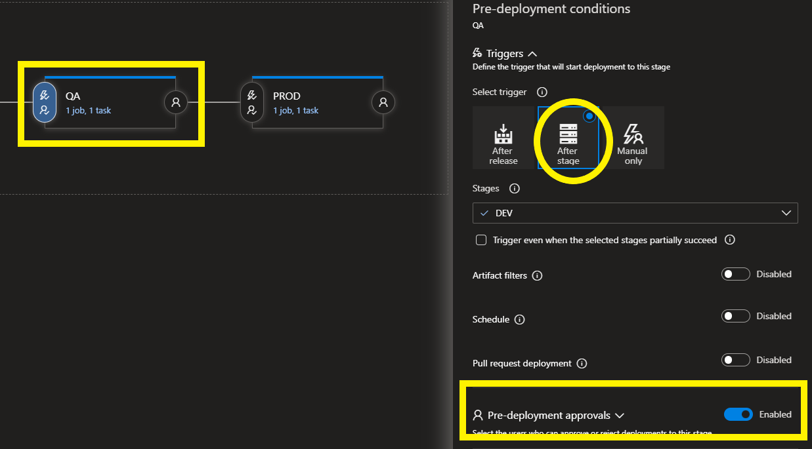
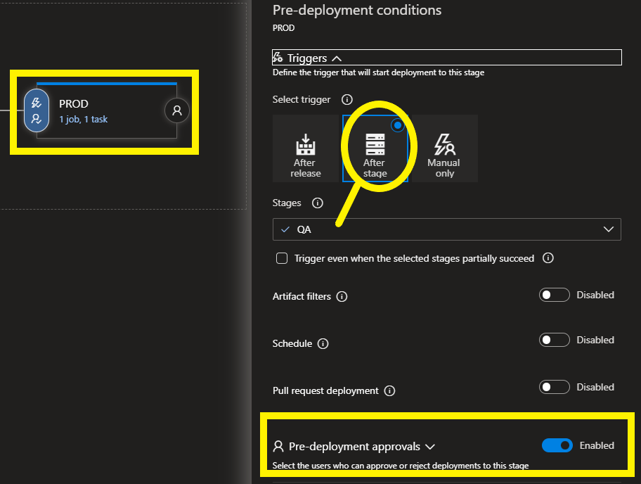

# SCENARIO 1
##### A car rental company called FastCarz has a .net Web Application and Web API which are recentlymigrated from on-premise system to Azure cloud using Azure Web App Service and Web API Service.
##### The on-premises system had 3 environments Dev, QA and Prod.
##### The code repository was maintained in TFS and moved to Azure GIT now. The TFS has daily builds which triggers every night which build the solution and copy the build package to drop folder. deployments were done to the respective environment manually. The customer is planning to setup Azure DevOps Pipeline service for below requirements:

===========================================================

1) The build should trigger as soon as anyone in the dev team checks in code to master branch.

- This can be achieved by enabling the Continuous Integration under Triggers and mention the Branch Specification to include 'Master'.

2) There will be test projects which will create and maintained in the solution along the Web and API.
The trigger should build all the 3 projects - Web, API and test.
 The build should not be successful if any test fails.

- After Visual Studio Tests being run, we have a task to publish the results where we have an option to enabling Fail if there is any failure occurred. 

3) The deployment of code and artifacts should be automated to Dev environment.
4) Upon successful deployment to the Dev environment, deployment should be easily promoted to QA
and Prod through automated process.
5) The deployments to QA and Prod should be enabled with Approvals from approvers only.
- In release pipelines, we can have a multi-stage setup for each environment

- DEV : Trigger set to After Release without having any pre-deployment approvals.

- QA: Trigger set to deploy upon DEV stage successful run and pre-deployment approvals would be set.

- PROD : It follows the same set of conditions as QA

