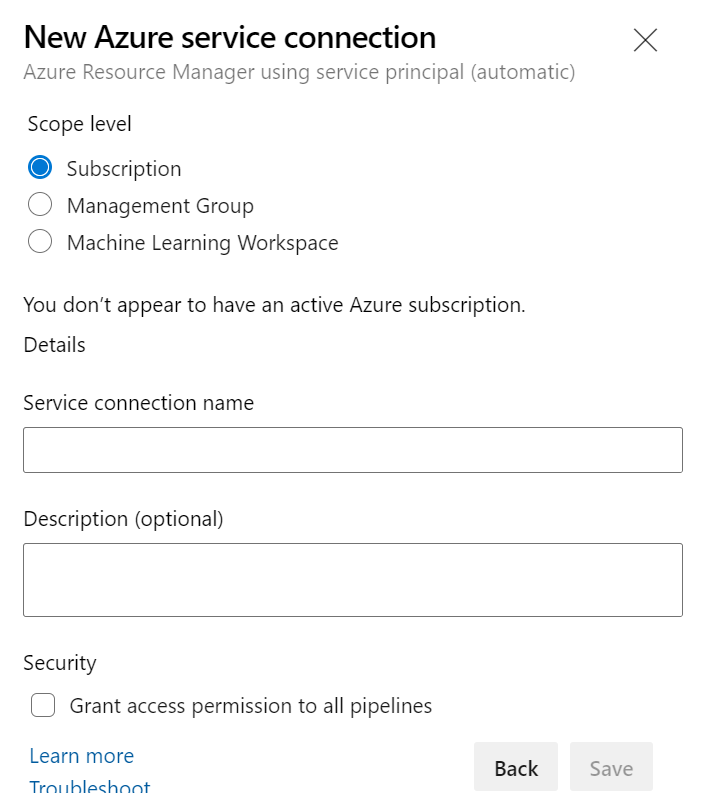
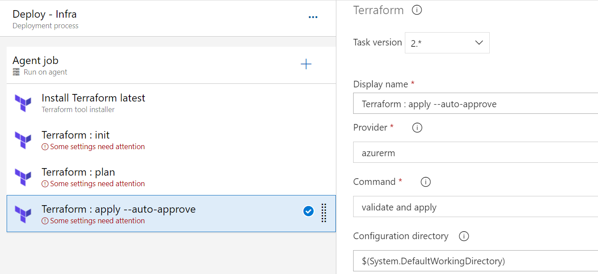
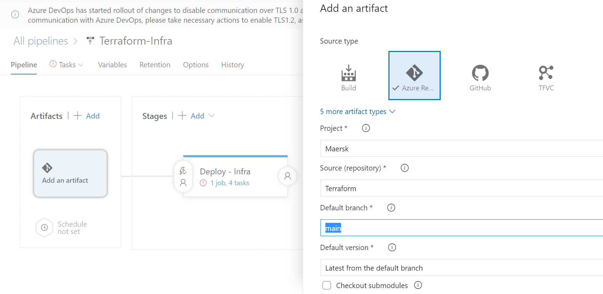
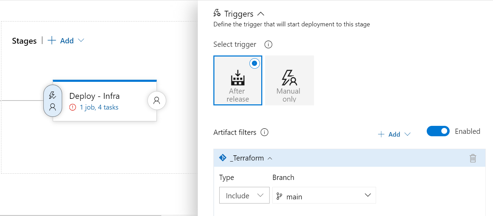
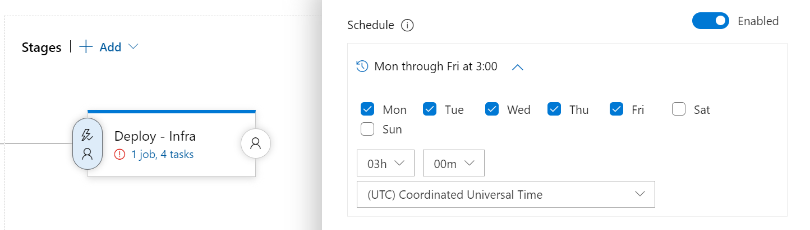
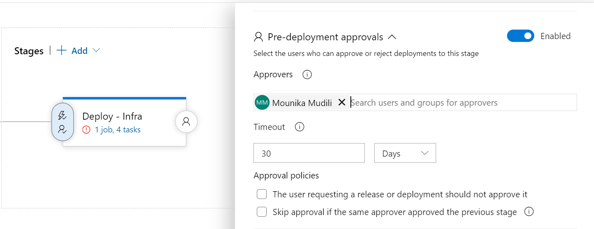

# SCENARIO 2
##### Macro Life, a healthcare company has recently setup the entire Network and Infrastructure on Azure.
##### The infrastructure has different components such as Virtual N/W, Subnets, NIC, IPs, NSG etc.
##### The IT team currently has developed PowerShell scripts to deploy each component where all the properties of each resource is set using PowerShell commands. The business has realized that the PowerShell scripts are growing over period of time and difficult to handover when new admin onboards in the IT.
##### The IT team has now decided to move to Terraform based deployment of all resources to Azure.
##### All the passwords are stored in a Azure Service known as key Vault. The deployments needs to be automated using Azure DevOps using IaC(Infrastructure as Code).

===============================================================================

1) What are different artifacts you need to create - name of the artifacts and its purpose
- Build Artifact : Copy Terraform Files Task and Publish Artifact would be part of Build Pipeline.
- Artifact Source - AzureReposGIT : By Creating a repository in ADO and adding source repo directly in Release pipeline can also be done.

2) List the tools you will to create and store the Terraform templates.
- VisualStudioCode : IDE to create template files
- Terminal/Developer Command Prompt : To perform actions with GIT repo
- Azure Portal/Azure CLI : To deploy pre-requisite resources
- AzureDevOps :
     1. Repos - To keep the source code (Terraform Config files)
     2. Pipelines - For CI/CD Operations

3) Explain the process and steps to create automated deployment pipeline.
- Create Azure Resource Manager Service Connection and Enable Grant access to Azure Pipelines.
  
- Create Azure KeyVault and a secret to store VMadmin password.
     1. Under KV Access Policies, Access need to be enabled to ARM for Template deployment.
     2. In Vault Access Policy Permissions, KV key permissions need to be provided to ServicePrincipal
- Create Release Pipeline with Terraform tool installer task to mention the version and terraform tasks to run 'init','plan' and 'apply'.
  
- Add Artifact with Source as Azure Repos and point it to the latest version of the repository code from master branch.
  
- Pre-deployment Conditions can be set based on our requirement:
   1. Artifact Filter Trigger
  
   2. Time Trigger
  
   3. Pre-Deployment Approvals
  
   4. Pull Request Deployment

4) Create a sample Terraform template you will use to deploy Below services:
 Vnet
 2 Subnet
 NSG to open port 80 and 443
 1 Window VM in each subnet
 1 Storage account
 - Terraform .Tf files are present under terraform folder.

5) Explain how will you access the password stored in Key Vault and use it as Admin Password in the VM
Terraform template.
- Password can be accessed in two ways:
     1. By Creating Variable group in Azure DevOps and integrate it with Keyvault, then It can be passed to Azure Release pipelines.
     2. Passing the KV details in Data blocks under terraform config to read the secret.